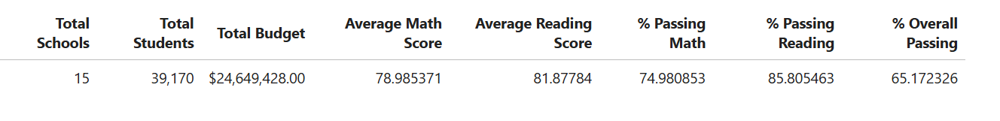
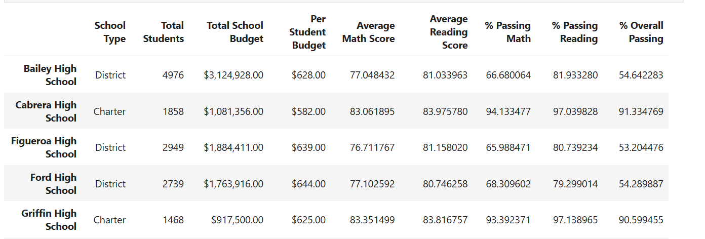

# Pandas Challenge

The purpose of this challenge is to help the school board and mayor make strategic decisions regarding future school budgets
and priorities in our city school district.

In this task, we've been asked to analyze the district-wide standardized test results. We were given access 
to every student's math and reading scores, as well as various information on the schools they attend. Our task is 
to aggregate the data to showcase obvious trends in school performance.

## District Summary
This summary includes:
* Total number of unique schools
* Total students
* Total budget
* Average math score
* Average reading score
* % passing math (the percentage of students who passed math)
* % passing reading (the percentage of students who passed reading)
* % overall passing (the percentage of students who passed math AND reading)

## School Summary
This summary includes:
* School name
* School type
* Total students
* Total school budget
* Per student budget
* Average math score
* Average reading score
* % passing math (the percentage of students who passed math)
* % passing reading (the percentage of students who passed reading)
* % overall passing (the percentage of students who passed math AND reading)

## Further Analysis
This includes:
* Highest-Performing Schools (by % Overall Passing)
* Lowest-Performing Schools (by % Overall Passing)
* Math Scores by Grade (9th, 10th, 11th, 12th)
* Reading Scores by Grade (9th, 10th, 11th, 12th)
* Scores by School Spending
* Scores by School Size
* Scores by School Type

## Note: 
In this challenge we were provided with PyCitySchools_starter.ipynb, and I built it from there
to get the final analysis which you will find in main_script.ipynb
